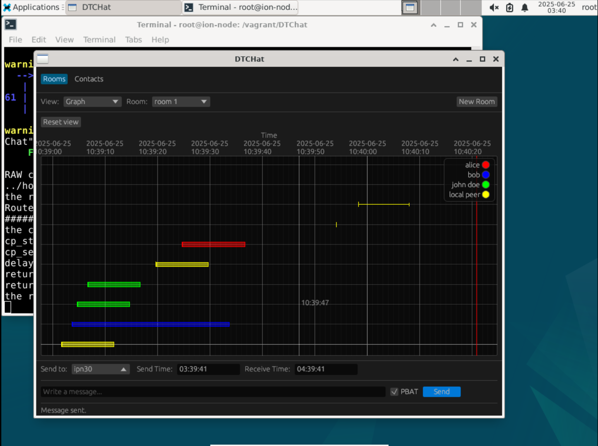

# DTChat - Delay Tolerant Network Chat Application

[](LICENSE) [](https://www.rust-lang.org)

DTChat is a modern, GUI-based chat application designed for Delay Tolerant Networks (DTN) using Bundle Protocol communication. Built with Rust and egui, it provides real-time messaging with predictive delivery times through advanced routing algorithms.

## Features

- **Bundle Protocol Integration**: Native support for ION-DTN and bp-socket
- **PBAT (Predicted Bundle Arrival Time)**: Real-time delivery predictions using A-SABR routing algorithms
- **Modern GUI**: Clean, responsive interface built with egui framework
- **Multiple Views**: Message list, timeline graph, and data table visualizations
- **Protobuf Support**: Efficient message serialization and ACK support
- **Real-time Updates**: Live message status and delivery confirmations
- **Contact Plan Integration**: ION contact plan parsing for optimal routing

## Architecture

DTChat is organized into several well-defined modules with a clear separation between the user interface (dtchat-egui) and business logic (dtchat-backend):

### Project Structure

```
dtchat-egui/                # Main GUI application
├── src/
│   ├── main.rs            # Application entry point
│   ├── app.rs             # Main DTChat application logic
│   ├── config/            # Configuration and settings
│   │   ├── mod.rs
│   │   ├── app.rs         # Peer and environment configuration
│   │   └── prediction.rs  # PBAT/A-SABR configuration
│   ├── domain/            # Business models
│   │   ├── mod.rs
│   │   └── peer.rs        # Peer and endpoint definitions
│   ├── ui/                # User interface
│   │   ├── mod.rs
│   │   ├── main.rs        # Main interface and views
│   │   ├── components/    # Reusable UI components
│   │   │   ├── mod.rs
│   │   │   ├── header.rs           # Header with peer info
│   │   │   ├── message_forge.rs    # Message creation
│   │   │   └── message_settings_bar.rs # Settings bar
│   │   └── views/         # Display views
│   │       ├── mod.rs
│   │       ├── graph.rs   # Timeline graph view
│   │       ├── list.rs    # Message list view
│   │       └── settings.rs # Settings view
│   └── utils/             # Utilities
│       ├── mod.rs
│       ├── logging.rs     # Logging system
│       ├── time.rs        # Time utilities
│       ├── uuid.rs        # UUID management
│       └── yaml.rs        # YAML file reading

dtchat-backend/             # Chat and network engine
├── src/
│   ├── lib.rs             # Backend library
│   ├── main.rs            # Command line interface
│   ├── dtchat.rs          # Main chat model
│   ├── message.rs         # Messages and sorting strategies
│   ├── event.rs           # Event system
│   ├── proto_message.rs   # Protocol Buffer messages
│   ├── db/                # Data layer
│   │   ├── mod.rs
│   │   └── simple_vec.rs  # In-memory database
│   └── proto/
│       └── message.proto  # Protocol Buffer definitions

socket-engine/              # Low-level network engine
├── src/
│   ├── lib.rs
│   ├── main.rs
│   ├── engine.rs          # Communication engine
│   ├── endpoint.rs        # Endpoint definitions
│   ├── socket.rs          # Socket management
│   └── event.rs           # Network events
```

### Modular Architecture

#### 1. User Interface (dtchat-egui)
- **UI Layer**: Modern graphical interface with egui
- **Components**: Reusable components (header, forge, settings)
- **Views**: Different display views (list, graph, settings)
- **Configuration**: Configuration and peer management

#### 2. Business Logic (dtchat-backend)
- **Chat Model**: Message and conversation management
- **Message System**: Message sorting and filtering (Standard/Relative)
- **Event System**: Event system for inter-module communication
- **Database**: Storage abstraction layer

#### 3. Network (socket-engine)
- **Network Engine**: Network connection management
- **Endpoints**: TCP, UDP, Bundle Protocol support
- **Socket Management**: Low-level communication handling
- **Event Handling**: Asynchronous network events


## Quick Start

### Prerequisites

- **Rust 1.70+**: [Install Rust](https://rustup.rs/)
- **ION-DTN or bp-socket**: Bundle Protocol daemon
- [Protobuf](https://protobuf.dev/installation/)
### Running DTChat Local Instances

DTChat now uses a simplified configuration system with a single `peer.yaml` file and the `PEER` environment variable to specify which peer to run as.

#### Quick Start

Open **multiple terminal windows** and run different peer instances:

```bash
# Terminal 1 - Run as peer 1
PEER_UUID=1 cargo run

# Terminal 2 - Run as peer_UUID=1 cargo run 2  
PEER_UUID=2 cargo run

# Terminal 3 - Run as peer_UUID=1 cargo run 3
PEER_UUID=3 cargo run
```

### Configuration

DTChat uses a simplified configuration system:

#### Default Configuration
- **Configuration file**: `db/default.yaml` - Contains all peer configurations
- **Peer selection**: Use `PEER_UUID` environment variable to specify which peer to run as
- **Example**: `PEER_UUID=1 cargo run` runs the application as peer with UUID "1"


#### Examples
```bash
# Use default configuration (db/peer.yaml)
PEER_UUID=1 cargo run
```


**Configure contact plan (example)**:

```
# ION Administration
a contact +0 +86400 30 30 100000
a range +0 +86400 30 30 1

# Bundle Protocol 
a protocol tcp 1400 100
a induct tcp 192.168.50.10:4556 tcpcli
a outduct tcp 192.168.50.30:4556 tcpclo
```

## Usage

### Basic Chat

1. **Start DTChat**: `PEER_UUID=1 cargo run` (or any peer ID from db/default.yaml)
2. **Select a peer** from the dropdown menu
3. **Click on the PBAT checkbox (optional)** to view delivery time prediction
4. **Type your message** in the input field
5. **Press Enter or click Send**
6. **View delivery predictions** in real-time (if PBAT enabled)


*DTChat Main Interface Showing Type Of Messages (Sent, Sent with PBAT enabled and Received Messages)*

### Message Status Indicators

- **Sent Messages**: `[sent_time->predicted_time][sender]`
- **Received Messages**: `[sent_time->received_time✓][sender]`
- **Failed Delivery**: Error indicators and retry options


### Views

- **List View**: Chronological message display
- **Graph View**: Timeline with delivery predictions
- **Table View**: Structured data with timestamps


## Advanced Features

### A-SABR Routing Integration

DTChat integrates with the A-SABR (Adaptive Schedule-Aware Bundle Routing) framework for:
- **Contact Plan Analysis**: Parses ION contact plans for network topology
- **Route Optimization**: Calculates optimal paths based on contact schedules
- **Delivery Prediction**: Estimates message arrival times with high accuracy
- **Dynamic Adaptation**: Adjusts routes based on network conditions

### Protocol Buffer Support

Efficient message serialization with:
- **Message Types**: Text, ACK, status updates
- **Delivery Tracking**: Message UUIDs and delivery confirmations
- **Compression**: Optimized for bandwidth-constrained networks
- **Compatibility**: Backward compatibility with text-mode debugging

### Network Protocols

Supports multiple transport mechanisms:
- **Bundle Protocol**: Native DTN communication
- **TCP/UDP**: Traditional networking for testing
- **ION Integration**: Direct integration with NASA's ION-DTN
- **bp-socket**: Kernel-level Bundle Protocol support


## Development & Contributing

If you would like to contribute or have questions about the project, please contact:

- Charley GEOFFROY: [charley.geoffroy@protonmail.com]
- Olivier DE JONCKERE: [olivier.de-jonckere@lirmm.fr]

We welcome your feedback and contributions!

### Prerequisites

- **Rust Toolchain**: Ensure you have Rust 1.70+ installed
- **Protobuf Compiler**: Install [protoc](https://protobuf.dev/installation/)

## License

This project is licensed under the MIT License - see the [LICENSE](LICENSE) file for details.

## Acknowledgments

- **A-SABR Framework**: Advanced routing algorithms for DTN networks
- **ION-DTN**: NASA's Interplanetary Overlay Network
- **egui**: Immediate mode GUI framework for Rust
- **DTN Research Community**: For delay-tolerant networking innovations

## Related Projects

- **[A-SABR](https://github.com/DTN-MTP/A-SABR)**: Adaptive Schedule-Aware Bundle Routing
- **[bp-socket](https://github.com/DTN-MTP/bp-socket)**: Kernel-level Bundle Protocol support
- **[ION-DTN](https://sourceforge.net/projects/ion-dtn/)**: NASA's DTN implementation

---
